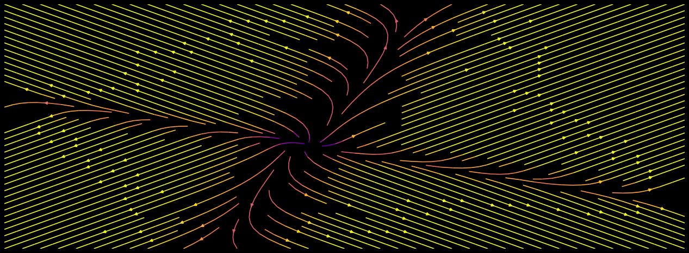
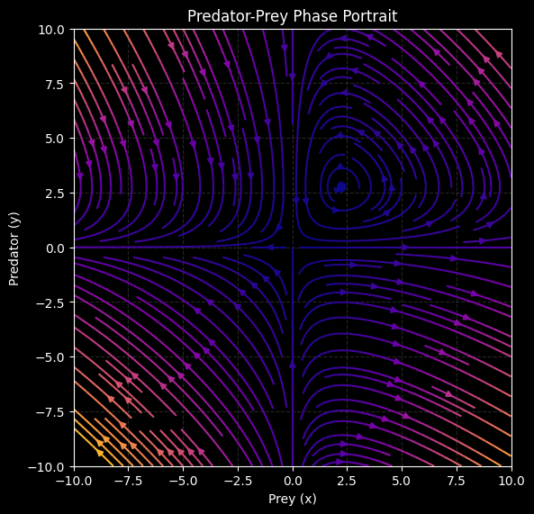
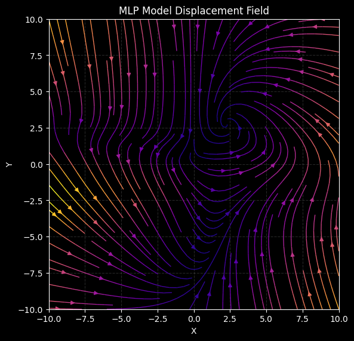
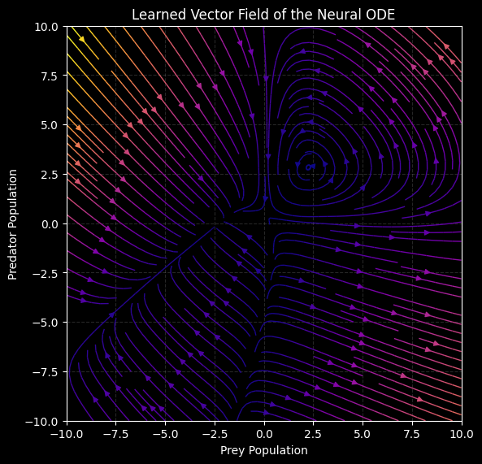

# **Uma Análise Empírica e Otimização do Modelo GRU-ODE-Bayes**

<br>
<br>
<br>

**Gabriel Martins Silveira de Oliveira**
*Universidade de Brasília (UnB)*

---

## Roteiro

1.  **Motivação:** O problema com séries temporais do mundo real.
2.  **A Solução Teórica:** De RNNs para Equações Diferenciais (NODEs).
3.  **Prova de Conceito:** Aprendendo a dinâmica do modelo Presa-Predador.
---
4.  **O Experimento Principal:** Classificação de arritmias com GRU-ODE-Bayes.
    -   Processamento dos Dados
    -   Implementação e Otimização
5.  **Resultados Surpreendentes:** A falha do modelo complexo.
6.  **Conclusões e Lições Aprendidas.**

---

## 1. Motivação: O Limite dos Modelos Discretos

As Redes Neurais Recorrentes (RNNs) são poderosas, mas operam em **passos de tempo discretos e regulares**.

---

### **O Problema:** 
Dados do mundo real, como prontuários médicos, são **irregulares e esporádicos**.

- Como modelar o que acontece *entre* as observações?
- Como lidar com intervalos de tempo variáveis?

---

## 2. A Solução Teórica: Do Discreto ao Contínuo

A ideia da **Neural Ordinary Differential Equation (NODE)** é trocar a recorrência discreta por uma dinâmica de tempo contínuo.

---

## RNN (Discreta)

$$\vec{h}_{t+1} = f(\vec{h}_t, \theta_t)$$

<br>

## NODE (Contínua)
$$\frac{d\vec{z}(t)}{dt} = f(\vec{z}(t), \theta, t)$$

---

Em vez de aprender a transição, aprendemos a **derivada** do estado oculto. O estado em qualquer tempo futuro é obtido via integração.

---

## O Desafio: Como Treinar um Integrador?

O backpropagation através de um solver de ODEs é computacionalmente caro.

---

## A Solução: O Método Adjunto

Em vez de salvar todos os estados intermediários, resolvemos uma segunda ODE, "para trás" no tempo, para calcular os gradientes.

---

### **Equação do Estado Adjunto:**  
  $$\dot{\vec{\lambda}}^{T} = - \vec{\lambda}^{T}\ \frac{\partial f}{\partial \vec{z}}$$

<br>

### **Gradiente Final:** 
  $$\frac{d L}{d \theta} = \int_{t_1}^{t_0} \vec{\lambda}^{T}(t)\ \frac{\partial f}{\partial \theta}\ dt$$

---

### Isso permite treinar o modelo com **custo de memória constante** ($O(1)$).

---

### **Pequena Prova**
Conforme vimos:
$$
\dot{\vec{z}} = f(\vec{z}, \theta, t)
$$
##### **Objetivo**: Minimizar a função de perda ($L$) em relação aos parâmetros $\theta$. 
##### **Problema**: A dependência de $L$ em $\theta$ não é explícita.

---

##### **Solução**: Introduzimos um novo funcional, $\mathcal{L}$.

$$
\mathcal{L}(\vec{z}, \vec{\lambda}, \theta) =
L(\vec{z}(\tau, \theta)) +
\int_{0}^{\tau} \vec{\lambda}^{T} (t)
\left[
f(\vec{z}, \theta, t) - \dot{\vec{z}}
\right]
\ dt
$$

Utilizamos multiplicadores de Lagrange para incorporar a restrição dinâmica.

---

#### Quando a restrição é satisfeita: $\mathcal{L} = L$ 
$$
\delta \mathcal{L} = \delta L = \frac{d L}{d \theta}\ \delta \theta
$$
A dependência de $L$ em $\theta$ é implícita, mediada pela trajetória $\vec{z}(t, \theta)$.

---

#### Calculamos a primeira variação do funcional $\mathcal{L}$:

$$
\delta \mathcal{L} = 
\frac{\delta \mathcal{L}}{\delta \vec{z}}\ \delta \vec{z} + 
\frac{\delta \mathcal{L}}{\delta \theta}\ \delta \theta + 
\frac{\delta \mathcal{L}}{\delta \vec{\lambda}}\ \delta \vec{\lambda}
$$

---

#### Variação em Relação a $\vec{\lambda}$

A variação do funcional em relação ao multiplicador $\vec{\lambda}$ **recupera** a restrição dinâmica original.
$$
\dot{\vec{z}} = f(\vec{z}, \theta, t)
$$

---

#### Variação Explícita em Relação a $\theta$

$$
\frac{\delta \mathcal{L}}{\delta \theta}\ \delta \theta =
\int_{0}^{\tau} \vec{\lambda}^{T} (t)\
\frac{\partial f}{\partial \theta}\ dt\ \delta \theta
$$

---

#### Variação em Relação a $\vec{z}$

$$
\frac{\delta \mathcal{L}}{\delta \vec{z}}\ \delta \vec{z} =
\frac{\partial L}{\partial \vec{z}(\tau)}\ \delta \vec{z}(\tau) +
\int_{0}^{\tau} \vec{\lambda}^{T} (t)\left[\
\frac{\partial f}{\partial \vec{z}}
\ \delta \vec{z} - \delta \dot{\vec{z}}\
\right]\ dt
$$

---

#### **Aplicamos integração por partes:**
$$
-\int_{0}^{\tau} \vec{\lambda}^T \delta \dot{\vec{z}} \ dt = 
\int_{0}^{\tau} \dot{\vec{\lambda}}^T \delta\vec{z} \ dt - 
\left[\ \vec{\lambda}^T \delta\vec{z}\ \right]_{0}^{\tau}
$$

---

#### **Substituindo:**
$$
\frac{\delta \mathcal{L}}{\delta \vec{z}}\ \delta \vec{z} =
\left( 
    \frac{\partial L}{\partial \vec{z}(\tau)} - \vec{\lambda}^T(\tau) 
\right) \delta\vec{z}(\tau) + 
\vec{\lambda}^T(0)\ \delta\vec{z}(0) +
\int_{0}^{\tau} \left[
\vec{\lambda}^{T}\ \frac{\partial f}{\partial \vec{z}} +
\dot{\vec{\lambda}}^{T}\
\right]\delta \vec{z} \ dt
$$

1. O termo $\delta\vec{z}(0)$ é nulo, pois a condição inicial $\vec{z}(0)$ é fixa.
2. Podemos *escolher* a definição do nosso vetor adjunto $\vec{\lambda}(t)$ de forma estratégica.

---

Definindo $\vec{\lambda}(t)$ de forma a anular a equação acima, obtemos:

#### **1. Condição de Contorno no Tempo Final $(\tau)$:**
Para anular o termo de fronteira em $\tau$:

$$
\frac{\partial L}{\partial \vec{z}(\tau)} - \vec{\lambda}^T(\tau) = 0 \quad \implies \quad 
\vec{\lambda}^T(\tau) = \frac{\partial L}{\partial \vec{z}(\tau)}
$$

---

#### **2. Equação Diferencial do Estado Adjunto:**
Para anular o termo da integral para qualquer variação $\delta\vec{z}(t)$:
$$
\dot{\vec{\lambda}}^{T} + \vec{\lambda}^{T}\ \frac{\partial f}{\partial \vec{z}} = 0 
\quad \implies \quad 
\dot{\vec{\lambda}}^{T} = - \vec{\lambda}^{T} \frac{\partial f}{\partial \vec{z}}
$$

---

#### **Por fim**, usando os resultados obtidos:

$$
\delta L = \frac{d L}{d \theta}\ \delta \theta =
\int_{0}^{\tau} \vec{\lambda}^{T} (t)\
\frac{\partial f}{\partial \theta}\ dt\ \delta \theta
$$

$$\implies$$

$$
\frac{d L}{d \theta} =
\int_{0}^{\tau} \vec{\lambda}^{T} (t)\
\frac{\partial f}{\partial \theta}\ dt
$$

---

## 3. Prova de Conceito: Aprendendo um Sistema Dinâmico

### **Pergunta:** Um NODE consegue aprender a "física" de um sistema conhecido?

### **Teste:** Modelo Lotka-Volterra (presa-predador).

---

### Diagrama de Fase do Modelo **Lotka-Volterra**



---

### Diagrama de Fase do **MLP**



---

### Diagrama de Fase do **NODE-ReLU**



---

### **Resultado:** Sim! Um NODE com ativação ReLU aprende o campo vetorial quase perfeitamente, enquanto um MLP padrão falha. O viés indutivo do NODE é poderoso para aprender dinâmicas.

---

## 4. O Experimento Principal: **GRU-ODE-Bayes**

### **Objetivo:** 
Usar o modelo estado da arte **GRU-ODE-Bayes** para classificar arritmias cardíacas a partir de dados de ECG (MIT-BIH, BIDMC).

---

### **Como funciona:**
- **Entre observações:** 
  Usa um solver de ODE para evoluir o estado oculto.
- **Em cada observação:** 
 Usa um update inspirado em GRUs para incorporar a nova informação.

Um modelo teoricamente perfeito para dados médicos esporádicos.

---

## Processamento dos Dados: Uma Etapa Crítica

Dados de ECG são longos e possuem tamanhos variados (de 30 min a 30+ horas).

---

### **Problemas:**
1.  Lotes de dados desbalanceados causam erros de memória na GPU.
2.  Processar cada paciente individualmente é extremamente lento.

---

### **Solução: "Chunking"**
- Cada registro longo foi segmentado em "chunks" (pedaços) menores, de tamanho uniforme e sobrepostos.
- Isso criou um dataset com amostras de tamanho previsível, estabilizando o treinamento.

---

```python
def chunk_patient_data(
    patient_data: Dict[str, Any],
) -> List[Dict[str, Any]]:
    # ...
    num_events = len(times)
    if num_events <= chunk_size:
        return [patient_data]
    # ...
    while start_idx < num_events:
        end_idx = min(start_idx + chunk_size, num_events)
        # Cria um chunk com dados estáticos
        chunk = {
            "id": f"{patient_data['id']}_chunk{len(chunks)}", # ...
        }
        chunk_times = times[start_idx:end_idx]
        # Nota: Tornamos cada chunk uma série temporal independente
        chunk["times"] = chunk_times - chunk_times[0]
        # ...
        start_idx += chunk_size - chunk_overlap
        if end_idx == num_events:
            break

    return chunks
```
---

## Implementação e Otimização

O maior gargalo de performance era o loop em Python que alternava entre `odeint` e o update do GRU.

---

### ❌ Abordagem Ingênua

```python
def forward(...):
  # ...
  for i, obs_time in enumerate(times):
      # Propagação da ODE até a próxima observação
      while current_time < (obs_time - 0.001 * delta_t):
          if self.solver == "dopri5":
              h, p, current_time, ... = self.ode_step(
                  h, p, obs_time - current_time, current_time
              )
  # ...
```
---

```python
def ode_step(self, h, p, delta_t, current_time):
    """Executa um único passo da ODE."""
    # ...
    if self.impute is False:
        p = torch.zeros_like(p)

    if self.solver == "euler":
        h = h + delta_t * self.gru_c(p, h)
        p = self.p_model(h)
  # ...
```

---

**Dependências em laços Python e iterações longas, sem o método adjunto.**

---

### ✅ Abordagem Vetorizada

```python
def forward(...):
    h = self.cov_model(cov)  # Chute inicial com parâmetros estáticos
    # ...
    t_all = torch.cat([torch.tensor([0.0], device=times.device), times])
    t_all = torch.unique(t_all)
    # ...
    # --- Chama o Solver ODE ---
    # Obtém o estado oculto em cada instante de tempo único
    h_all_times = odeint_adjoint(
      self.dynamics,
      h,
      t_all,
      # ...
    )  # Shape: [num_times, batch_size, hidden_size]
```
---

**Sem loops em Python; todas as ações são chamadas de módulos do `PyTorch`. A solução da ODE é realizada apenas uma vez.**

---

## 5. Resultados (1): A Surpreendente Ineficácia

Comparamos o modelo completo com um **baseline simples** (mesma arquitetura, mas sem o solver de ODE).

---

```python
# Baseline (Sem ODE)
def forward_(...):
    # --- Esta parte é a mesma ---
    h = self.cov_model(cov)

    t_all = torch.unique(
        torch.cat([torch.tensor([0.0], device=times.device), times])
    )

    num_times = len(t_all)
    # Simplesmente expande o estado inicial para todos os tempos
    h_all_times = h.unsqueeze(0).expand(num_times, -1, -1)
    # ...
```

---

| Modelo | Acurácia (Validação) | Tempo / Época (CPU) |
| -------| -------------------- | ------------------- |
| GRU-ODE-Bayes (Full) | 62.0%  | ~1 hora             |
| **Baseline (Sem ODE)** | **97.78%** | **~30 segundos**    |

<br>

O modelo complexo não só foi **120x mais lento**, como também drasticamente **menos preciso**.

---

## Resultados (2): O Paradoxo da GPU

Mesmo com a implementação vetorizada, um comportamento estranho surgiu.

---

### **Tempo de Treinamento por Época**

<div style="text-align: center;">

### **CPU**: ~1 hora
### **GPU**: ~5 horas
</div>

---

### **A Causa:** 
O *overhead* de iniciar múltiplos kernels CUDA e gerenciar o estado adjunto com `odeint_adjoint` para muitos intervalos curtos é imenso. Para esta carga de trabalho específica, a CPU, com menor latência de chamada, foi mais eficiente.

---

## 6. Conclusões e Lições Aprendidas

---

### 1. **Elegância Teórica não Garante Sucesso Prático**

O GRU-ODE-Bayes, apesar de ser teoricamente ideal, não foi útil para *esta tarefa de classificação*. O viés indutivo de modelar a dinâmica contínua parece ter atrapalhado o aprendizado.

---

### 2. **Baselines Simples são Essenciais**

Um modelo mais simples e rápido superou o complexo de forma esmagadora. A complexidade deve ser justificada por ganhos de performance.

---

### 3. **Hardware é Dependente do Problema** 

"Usar uma GPU" não é uma solução universal. Cargas de trabalho com muitas operações pequenas e sequenciais podem ser mais rápidas na CPU.

---

### 4. **NODEs são a Ferramenta Certa para o Problema Certo**

Como vimos no exemplo presa-predador, eles são excelentes para aprender sistemas dinâmicos, mas não necessariamente para qualquer problema de série temporal.

---

## É o Fim das Redes Diferenciais?

Não. A teoria é extremamente interessante e, como vimos, as implementações ainda são muito novas e não otimizadas. O futuro é a paralelização, permitindo relações mais complexas como as que vemos em modelos como os Transformers.

--- 

# Obrigado!

**Perguntas?**

<br>
<br>

*Repositório e artigo disponíveis em:*
https://github.com/DaturaSol/neural-edo-bayes